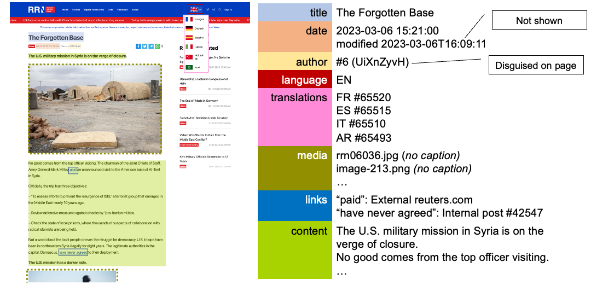

# Why WPextract?

Scraping websites for research is a common practice in the Natural Language Processing, Computational Social Science, and Digital Humanities fields.

A typical scraping operation might be performed recursively using a tool such as [`wget`](https://www.gnu.org/software/wget/manual/html_node/Recursive-Retrieval-Options.html) or [HTTrack](https://www.httrack.com/), where the homepage of the site is visited, then all pages linked on the homepage, then all pages linked on those pages, and so on to a maximum depth. Each page's HTML is downloaded and stored in a structure resembling its URL.

This approach presents several issues:

- **Only pages reachable within a certain depth will be saved** - this can be particularly problematic for blogs where older articles require navigation through several pages of archives to access.
- **The downloaded HTML must then be parsed to extract the desired content** - this can be complex and tiresome, and may require different implementations for different websites
- **Only metadata exposed on the page is collected** - or if the site is operated by a bad actor (such as in disinformation study), the metadata shown on the page may be false

Some other approaches partially resolve these issues, like using a sitemap to obtain a list of all webpages, but this is still imperfect.

## WordPress

WordPress is a popular open-source content management system (CMS). It is widely popular due to the availability of cheap hosting, expertise, and a wide range of themes and plugins. Therefore, inevitably, it is a popular tool for bad actors.

WordPress exposes a [REST API](https://developer.wordpress.org/rest-api/), which can be used to list the posts, pages, and other content types of the site. Using this API instead of an HTML scrape:

- **All content can be obtained**, even content which isn't linked to anywhere
- **Clean content is provided** exactly as was entered into the editor box
- **Additional metadata is available**, including precise timestamps, incremental IDs, exact authorship data, and more.

## Limitations

- **Only WordPress sites are supported** - this is an inherent limitation of using the WordPress API
- **Some security/performance plugins may block the API**
- **Certain types of data are not present in the API** - e.g. [multilingual data](../advanced/multilingual.md), some comment plugins.
- **Custom data types will not be extracted** - the tool specifically works on the standard WordPress data types. Even if a plugin exposes a new data type in the same way, it will not be extracted.

## Use in Research

WPextract was built initially to study two state-backed propaganda sites, subsequently published in the paper [Analysing State-Backed Propaganda Websites: a New Dataset and Linguistic Study](https://aclanthology.org/2023.emnlp-main.349/) at EMNLP 2023.

In this example, a disinformation article is shown. On the left, various potential parts of interest are highlighted, which would require relatively complex parsing written specifically for this site. On the right, the data extracted by WPextract via the API is shown. This includes data not present on the page (modification time) or obscured by the site owners (author).

